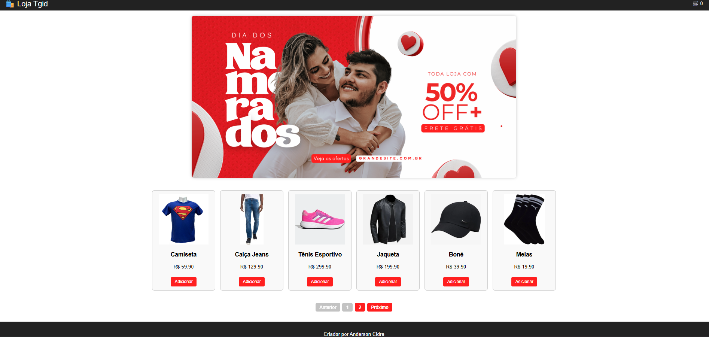

# 🛍️ Projeto Loja Online

Este é um projeto simples de uma loja online desenvolvido com **HTML**, **CSS** e **JavaScript puro**, consumindo uma API REST simulada com **JSON Server**.

## 🚀 Funcionalidades

- Listagem de produtos
- Paginação
- Carrinho de compras com:
  - Adição e remoção de itens
  - Limpar carrinho
  - Finalizar compra
  - Quantidade e total atualizados em tempo real
- Toasts para ações importantes
- Banner promocional responsivo
- Estilização moderna e responsiva

## 📦 Tecnologias Utilizadas

- HTML5
- CSS3
- JavaScript Vanilla (sem frameworks)
- [JSON Server](https://www.npmjs.com/package/json-server)

## 📁 Como executar o projeto

### 1. Clone o repositório
git clone https://github.com/bencidre/Projeto---Tg.git
cd Projeto---Tg

#2. Instale as dependências do JSON Server
npm install -g json-server

3. Inicie o servidor da API
json-server --watch dbTeste.json --port 3000

4. Inicie o servidor da loja (com http-server)
npm install -g http-server
npm run site

5. Acesse no navegador:
Loja: http://localhost:5500

API: http://localhost:3000/produtos

## 🖼️ Preview da loja

  

✍️ Autor
Anderson Cidre – @bencidre
